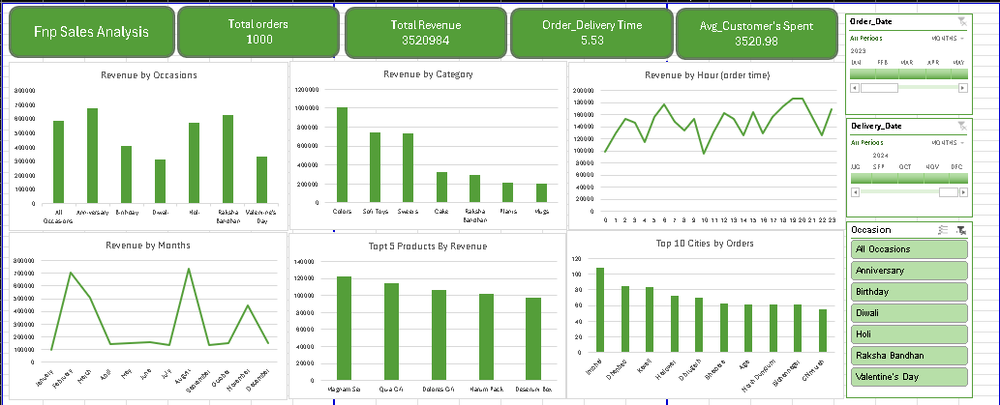

# FNP Sales Dashboard 📊

This project presents an interactive sales dashboard built in Microsoft Excel to analyze customer behavior and performance metrics for FNP (Flowers & Personalized Gifts).

## 🚀 Project Highlights

- Total Orders, Revenue, Avg. Spend, and Delivery KPIs
- Revenue breakdown by:
  - Occasion (e.g., Valentine’s Day, Raksha Bandhan)
  - Category (e.g., Cakes, Soft Toys)
  - Month, Hour, City, and Product
- Interactive slicers by Date and Occasion
- Executive Summary with actionable recommendations

## 📌 Key Insights

- **Top Sales Months:** February & August
- **Top Categories:** Cakes, Flowers, Soft Toys
- **High-Performing Cities:** Delhi, Mumbai, Hyderabad
- **Avg. Delivery Time:** 5.53 days
- **Avg. Customer Spend:** ₹3,520.98

## 📷 Screenshot

## 📁 Files Included

- `Fnp.xlsx` – The interactive Excel dashboard
- `Executive_Summary.pdf` – Final written analysis and recommendations
- `Dashboard.png` – Exported dashboard image

## 📝 License

This project is licensed under the [MIT License](LICENSE).

## 🙋‍♂️ Author

**[MOHAMED MAKRANI]**  
Email: makrani.mohamed@ump.ac.ma
 

